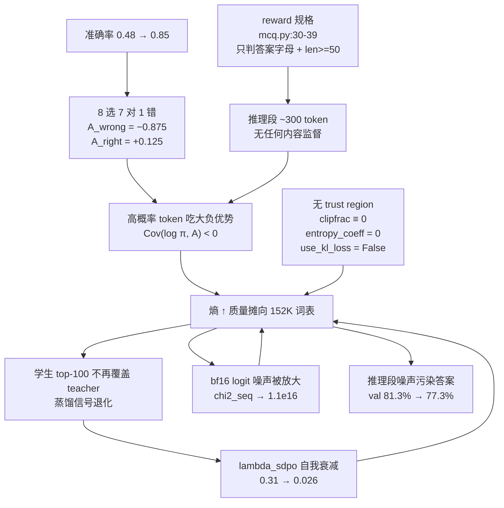
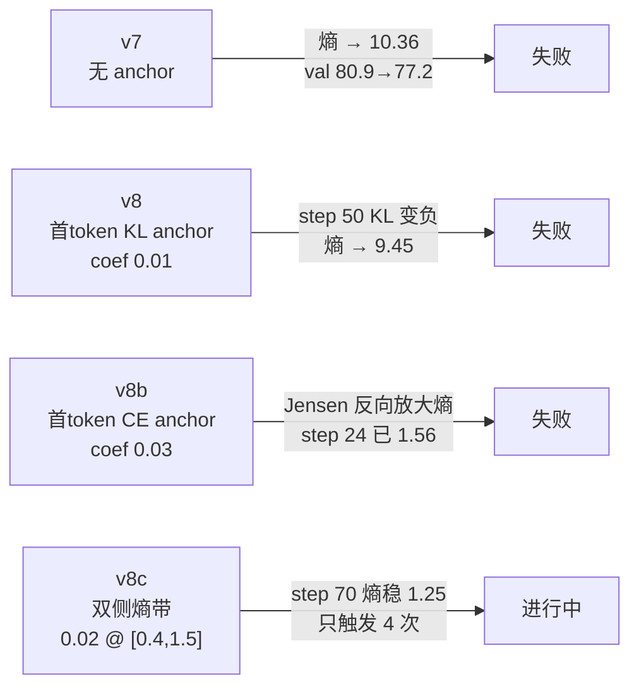
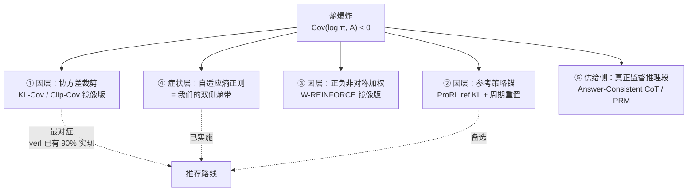
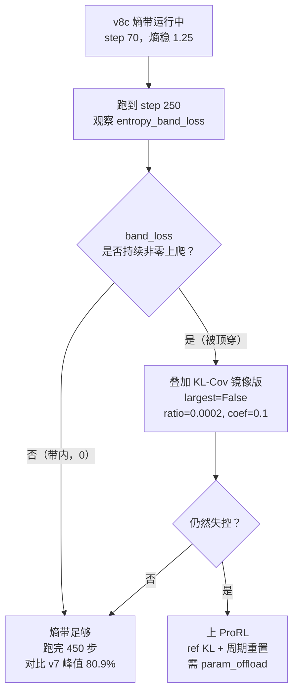

# 熵爆炸：诊断、理论与解法

> SRPO v7 / v8 训练发散的完整分析，附 2025–2026 学术界解法综述
>
> 数据来源：`outputs/srpo_v8_chem_rescueTrue`（450 步完整运行）、v8b（CE anchor，24 步）、v8c（熵带，进行中）

---

## TL;DR

| | 结论 |
|---|---|
| **现象** | `actor/entropy` 从 0.51 单调爆炸到 9.45，val 在 step 410 达到 81.3% 后掉到 77.3% |
| **理论** | 熵变 ≈ −η·Cov(log π, A)。**负协方差**（高概率 token 吃负优势）→ 熵上升 |
| **根因** | reward 只判答案字母，推理段唯一监督是 `len(reasoning) >= 50` → 推理段无约束 |
| **放大器** | ① 负优势棘轮 ② PPO 裁剪结构性失效 ③ 唯一锐化力自我衰减 ④ top-k 错位 ⑤ 数值分离 |
| **已实施** | 双侧熵带（症状层硬墙），属文献中 Adaptive Entropy Regularization 一族 |
| **待实施** | KL-Cov 镜像版（因层，verl 已有 90% 实现）；ProRL 式 ref KL + 周期重置（备选） |

---

## 1. 现象

### 1.1 熵轨迹（v8-old，KL anchor，450 步）

```
step   entropy   0 ──────────────────────────────── 10
   1     0.51    █▌
  25     0.81    ██▋
 100     0.79    ██▌
 150     0.75    ██▍
 200     1.21    ███▉
 250     1.48    ████▋      ← 分水岭
 300     3.14    ██████████
 350     4.95    ███████████████▊
 400     7.26    ███████████████████████▏
 415     8.42    ███████████████████████████
 450     9.45    ██████████████████████████████▏
```

熵 9.45 意味着什么：词表 152064，最大熵 ln(152064) = **11.93**。9.45 已达上限的 **79%**，等价于在约 `exp(9.45) ≈ 12700` 个 token 上接近均匀。

### 1.2 同步崩坏的其他指标

| 指标 | step 1 | step 250 | step 450 | 解读 |
|---|---|---|---|---|
| `actor/entropy` | 0.51 | 1.48 | **9.45** | 分布摊平 |
| `rollout_corr/training_ppl` | 1.73 | 7.62 | **15535** | ln(15535)=9.65 ≈ 熵，独立佐证摊平 |
| `srpo/lambda_sdpo` | 0.314 | 0.145 | **0.026** | 唯一锐化力消失 |
| `srpo/teacher_entropy_mean` | 0.49 | 1.15 | **0.097** | top-k 错位假象（见 §3.5） |
| `srpo/dw_weight_std` | 0.44 | 0.73 | **0.064** | 动态加权失效 |
| `rollout_corr/chi2_seq` | 0.67 | 9.2e14 | **1.1e16** | rollout/训练数值分离 |
| `critic/score/mean` | 0.53 | 0.72 | 0.85 | **奖励还在涨** |
| `val@16` | — | 77.5% | 77.3%（峰值 81.3%@410） | 峰后回落 |

**核心悖论**：分布接近均匀，奖励却有 0.85。§3.1 解答。

---

## 2. 理论框架

### 2.1 熵变的协方差刻画

2025 年这条线的统一结论（Cui et al. 2025；Revisiting Entropy 2025）：

```
ΔH  ≈  − η · Cov( log π(a) , A(a) )
```

按 token 展开：`cov_t = (A_t − Ā) · (log π_t − log π̄)`

### 2.2 四象限

```
                      log π  （该 token 的概率）
                    低 ◄──────────────► 高
                 ┌──────────────┬──────────────┐
                 │  Cov < 0     │  Cov > 0     │
            正   │              │              │
                 │   熵 ↑       │   熵 ↓       │
                 │  （探索）     │  （崩溃）     │ ← 学术界主流关注
   优势 A        ├──────────────┼──────────────┤
                 │  Cov > 0     │  Cov < 0     │
            负   │              │              │
                 │   熵 ↓       │   熵 ↑       │
                 │              │  （爆炸）     │ ← ★ 我们在这里
                 └──────────────┴──────────────┘
```

> Revisiting Entropy 原文：
> *"tokens with negative advantages cause the probabilities of sampled high-probability tokens to decrease, **spreading the mass and increasing entropy**"*

### 2.3 为什么是"棘轮"而非"弹簧"

```
softmax 的不对称性：

  抬高（A > 0）                      压低（A < 0）
  p: 0.7 ──► 0.9 ──► 0.99 ──► ...   p: 0.7 ──► 0.4 ──► 0.1 ──► 0.001
              ▲                                                  │
         接近 1 时饱和                            向 152K 个候选无限摊开
         梯度趋 0                                    没有下限
```

**压低无下限，抬高有上限。** 两者不对称 → 净效应是单向摊平 = 棘轮。

### 2.4 一个重要分歧（为何有些论文报告相反结论）

SimKO 报告的是反向的 "squeezing effect"：负更新时质量按比例重分配，top-1 反而获益最多 → 变尖。

两者不矛盾，**区别在于被压的 token 是不是 top-1**：

```
压 top-1（我们）                     压非 top-1（SimKO 场景）
 ┌─┬─┬─┬─┬─┐                        ┌─┬─┬─┬─┬─┐
 │█│▂│▁│▁│▁│  压 #1                 │█│▄│▁│▁│▁│  压 #2
 └┬┴─┴─┴─┴─┘                        └─┴┬┴─┴─┴─┘
  ▼                                     ▼
 ┌─┬─┬─┬─┬─┐                        ┌─┬─┬─┬─┬─┐
 │▄│▄│▃│▃│▃│  → 摊平，熵↑            │█│▁│▂│▂│▂│  → 变尖，熵↓
 └─┴─┴─┴─┴─┘                        └─┴─┴─┴─┴─┘
```

高准确率使模型自信、采样接近 argmax → 错误 rollout 压的正是 top-1 → 落入左侧。

---

## 3. 我们的因果链



### 3.1 根因：reward 不监督推理段

`verl/utils/reward_score/feedback/mcq.py:30-39`

```python
correct = float(multiple_choice_answer == ground_truth)   # 只看 <answer> 里的字母
has_reasoning = len(reasoning) >= 50                      # 只看长度！
reward = correct * (0.5 if not has_reasoning else 1.0)
```

整个 `<reasoning>` 段唯一的监督是**字数 ≥ 50**。内容通不通顺、是不是真词，一概不管。

**这解释了核心悖论**：

```
模型输出结构：
┌──────────────────────────────────────┬────────────────┐
│  <reasoning> ~300 token（无人监督）    │ <answer>B</answer> │
│  熵 ≈ 10（接近均匀，噪声）              │  熵 ≈ 0（尖锐）    │
└──────────────────────────────────────┴────────────────┘
       ↑ token-mean 熵被这段主导 = 9.45      ↑ 这段决定 score = 0.85
```

> **顺带纠正一个指标命名 bug**：`mcq.py:34` 把 `is_correct_format()` 的返回值赋给了 `incorrect_format`，语义是反的。
> 所以 `incorrect_format/mean@16 = 0.9993` 实际表示 **99.93% 格式正确**。格式一直是好的。

### 3.2 放大器①：负优势棘轮随准确率恶化

| 组内情况 | A_correct | A_wrong | 梯度效应 |
|---|---|---|---|
| 4 对 4 错 | +0.5 | −0.5 | 对称，温和 |
| 7 对 1 错 | +0.125 | **−0.875** | 少数错样本主导 |
| 8 对 0 错 | 0 | — | **完全无梯度** |

准确率越高 → 全对组越多（零梯度）→ 梯度越被"混合组里那个大负优势"主导。

实测相关性：

| step | score | entropy |
|---|---|---|
| 25 | 0.48 | 0.81 |
| 250 | 0.72 | 1.48 |
| 400 | 0.81 | 7.26 |
| 425 | **0.96** | — |

### 3.3 放大器②：PPO 裁剪结构性失效

`verl/workers/fsdp_workers.py:242-243`

```
ppo_mini_batch_size = 32 × rollout.n(8) ÷ n_gpus(8) = 32
每卡数据量 = 32 × 8 ÷ 8 = 32 条
→ data.split(32) 只产生 1 个 mini-batch
→ 加 ppo_epochs = 1
→ 每 batch 只有一次优化器步 → ratio ≡ 1
```

实测 450 步：`pg_clipfrac ≡ 0.0`、`ppo_kl ≡ 0.0`，**一次都没触发**。

```
理论上的三重保险            实际情况
┌────────────────┐        ┌────────────────┐
│ PPO 裁剪        │   →    │ 结构性失效 ✗    │
│ entropy_coeff  │   →    │ = 0        ✗   │
│ use_kl_loss    │   →    │ = False    ✗   │
└────────────────┘        └────────────────┘
                          只剩学习率在拦
```

### 3.4 放大器③：唯一的锐化力会自我衰减

SDPO 蒸馏把学生拉向尖锐的 teacher，是抗摊平的力。但 union 归一化让它的权重 = 失败率：

```
lambda_sdpo = sd_token_count / (grpo_token_count + sd_token_count)
```

| step | lambda_sdpo | entropy |
|---|---|---|
| 100 | 0.308 | 0.79 |
| 250 | 0.144 | 1.48 |
| 400 | 0.118 | 7.26 |
| 450 | **0.026** | 9.45 |

**准确率一上去，稳定器自己就没了 —— 恰好在最需要它的时候。**

### 3.5 放大器④：top-k 错位摧毁蒸馏与 DW

`teacher_entropy_mean` 掉到 0.097 是**假象**。teacher 是学生权重的 EMA，不可能真变尖。

```
dp_actor.py:879 —— teacher 的 log-prob 在【学生的 top-100 索引】上取

学生摊平前                          学生摊平后
学生 top-100 ⊇ teacher 高概率区      学生 top-100 ∩ teacher 高概率区 ≈ ∅
    ┌──────────┐                      ┌──────────┐
    │ ▓▓▓▓     │ teacher 质量在内      │      ░░░ │ teacher 质量全落 tail 桶
    └──────────┘                      └──────────┘
  → JSD 有信息                       → 101 桶里几乎全在 tail
                                     → 测出 H ≈ 0.097
                                     → dw = exp(−β·H) → 1 → std → 0.064
```

后果：**JSD 蒸馏退化为噪声，动态加权同时失效。**

### 3.6 放大器⑤：rollout / 训练数值分离

| step | `chi2_seq` | `is_seq_fraction_high` | `rollout_corr/kl` |
|---|---|---|---|
| 1 | 0.67 | 0 | +0.004 |
| 250 | 9.2e14 | 0.4% | −0.0002 |
| 450 | **1.1e16** | **4.7%** | **−0.0083** |

分布一平，bf16 的 logit 噪声就在相对概率上被放大 → IS 权重噪声 → 梯度噪声 → 漂移更快。**正反馈。**

### 3.7 首 token 反而是最健康的部分

| step | unique | H | top1 | pool_frac | 分布 |
|---|---|---|---|---|---|
| 0 | 2 | 0.693 | 51.5% | 0% | The .52, To .48 |
| 100 | 6 | 1.169 | 49.9% | 13.8% | To .50, The .36, This .05, 1 .04 |
| 200 | 8 | 1.531 | 42.0% | 31.0% | To .42, The .27, Determin .12 |
| 300 | 8 | 1.810 | 29.3% | 49.2% | To .29, The .22, Determin .14, 1 .13 |
| 400 | 9 | 2.049 | 18.4% | 55.4% | To .18, Determin .18, The .14, 1 .13, reason .12 |

全是**合理的句首词**，H = 2.05 ≈ ln(9)，是在 9 个合理候选上摊平（rescue 池注入所致，属设计预期）。

```
首 token 熵 2.05  ◄────── 差 4.6 倍 ──────►  全局熵 9.45
（9 个合理候选，健康）                      （~12700 个 token，崩坏）
```

**结论：爆炸不在首 token，而在推理段内部。** 这也是为什么 v8/v8b 的首 token anchor 从一开始就打错了地方。

---

## 4. 三次尝试的复盘



### 4.1 v8（KL anchor）为何失败：top-k KL 会变负

```
KL = Σ_topk  P · (log P − log Q)     ← 每项可正可负，截断后整体可为负
```

| step | 1 | 5 | 25 | **50** | 100 | 250 | 450 |
|---|---|---|---|---|---|---|---|
| `ft_ema_kl` | 0.0 | 0.45 | 0.63 | **−0.21** | −0.22 | −0.28 | −0.36 |

`pg_loss += 0.01 × (负值)` = 在**减少** loss = **主动推离 anchor**。从 step 50 起 anchor 反向工作。

### 4.2 v8b（CE anchor）为何失败：Jensen 不等式 + 正反馈

CE 恒非负，修好了变负问题。但目标选错了：

```
EMA 目标 = 跨 prompt 的【边缘分布】
策略     = 每 prompt 的【条件分布】

Jensen:   H( mean_i P_i )  ≥  mean_i H( P_i )
          └─── 目标 ───┘      └─── 策略 ───┘

→ 把条件分布拉向边缘分布，【必然】抬高熵
```

正反馈环：

```
策略摊平 ──► batch 均值更平 ──► EMA 吸收 ──► 目标更平 ──┐
    ▲                                                  │
    └──────────────────────────────────────────────────┘
```

实测（v8b）：

| step | `batch_ent`（条件） | `ema_ent`（边缘目标） | 差 |
|---|---|---|---|
| 18 | 0.82 | 1.60 | 目标高 0.78 |
| 20 | 1.05 | 1.74 | 目标高 0.69 |
| 22 | 1.60 | 1.89 | 目标高 0.29 |
| 24 | **2.11** | 2.03 | **策略已超过自己的 anchor** |

step 24 环已自持。

### 4.3 v8c（熵带）当前状态

```python
# dp_actor.py:1126-1133
over  = (entropy_agg - hi).clamp(min=0.0)     # hi = 1.5
under = (lo - entropy_agg).clamp(min=0.0)     # lo = 0.4
band_loss = over² + under²
policy_loss += 0.02 * band_loss
```

梯度剖面（实测）：

```
熵 H     0.2   0.4 ─────── 1.5   1.8    2.5    4.0    9.45
         ▲     └── 零梯度 ──┘     │      │      │      │
dL/dH  −0.008    0.0000        +0.012 +0.040 +0.100 +0.318
         │                       └──── 递增压力 ────────┘
    往上推，防崩溃
```

实测触发记录（69 步中仅 4 步）：

| step | entropy | band_loss |
|---|---|---|
| 10 | 1.33 | 0.0002 |
| 11 | **1.51** | **0.0133** ← 撞墙 |
| 12 | 1.46 | 0.0026 |
| 13 | 1.36 | ~0 |
| 14+ | 回落至 1.0–1.28 | **0** |

熵轨迹（v8c）：

```
step    1    6   11   16   21   36   46   51   56   61   66
熵    0.53 0.67 1.51 1.04 1.03 1.02 1.13 1.25 1.28 1.25 1.22
                 ▲    └──── 被拉回 ────┘  └── 走平于 ~1.25 ──┘
              撞墙
```

val 对比：

| step | v8-old (KL) | v8c (熵带) |
|---|---|---|
| 25 | 51.2% | 48.4% |
| 40 | 61.4% | 58.0% |
| 50 | 62.8% | 60.9% |
| 65 | 64.0% | **64.1%** ← 追平 |

健康度对比：

| 指标 | v8c @66 | v8-old 终态 |
|---|---|---|
| `training_ppl` | 3.59 | 15535 |
| `lambda_sdpo` | 0.19–0.35 | 0.026 |
| `teacher_entropy` | 1.11–1.21 | 0.097 |
| `grad_norm` | 0.10–0.25 | 0.146 |

> ⚠️ **v8-old 是到 step 250 才开始爆的。现在只到 70 步，仍在旧版安全区内，不能算验证通过。**

---

## 5. 学术界的四类手段



### 手段①　KL-Cov 镜像版 —— 只锁定"最负协方差"的极少数 token

**最对症，而且我们的 verl 里已经实现了 90%**：`core_algos.py:1809 compute_policy_loss_kl_cov`

```python
cov = (adv - adv.mean()) * (logp - logp.mean())
large_cov_idxs = torch.topk(cov, k, largest=True).indices        # ← 只取最正的
pg_losses[idx] = -A*ratio + ppo_kl_coef * |log_prob - old_log_prob|
```

现有实现取 `largest=True`（最正协方差），因为原论文治的是**崩溃**。治**爆炸**只需镜像：

```
所有 response token 按协方差 cov_t 排序
最负 ◄──────────────────────────────────────────────────► 最正
┌─────┐                                              ┌─────┐
│▓▓▓▓▓│                                              │▒▒▒▒▒│
└─────┘                                              └─────┘
  ▲                                                     ▲
  │                                                     │
我们要锁的（熵爆炸元凶）                      原论文锁的（熵崩溃元凶）
largest = False                              largest = True
bottom 0.02%                                 top 0.02%
高概率 token + 负优势                          高概率 token + 正优势
```

**为什么优于全局熵带**：论文的核心发现是**极少数 token 主导整个熵变**，所以 `kl_cov_ratio` 默认仅 **0.0002**（万分之二）。熵带管的是**聚合症状**，KL-Cov 管的是**具体肇事 token** —— 精准得多，对正常学习的干扰也小得多。

现成参数（`verl/trainer/config/actor/actor.yaml:64-76`）：

| 参数 | 默认 |
|---|---|
| `policy_loss.kl_cov_ratio` | 0.0002 |
| `policy_loss.ppo_kl_coef` | 0.1 |
| `policy_loss.clip_cov_ratio` | 0.0002 |
| `policy_loss.clip_cov_lb / ub` | 1.0 / 5.0 |

**对本项目的适配点**：SRPO 分支直接调 `compute_policy_loss_vanilla`（`dp_actor.py:937-945`），所以要把协方差逻辑搬进 SRPO 的 GRPO 分支，约 10 行。

### 手段②　ProRL 式：参考策略 KL + 周期性硬重置

```
L = L_GRPO − β · D_KL(π_θ ‖ π_ref)
```

关键不是 KL 本身，而是**重置策略**：

```
        val 上升            val 退化/停滞
          │                     │
          ▼                     ▼
   ┌─────────────┐      ┌──────────────────┐
   │ 正常训练     │ ───► │ 硬重置 π_ref ← π_θ │
   │ KL 约束漂移  │      │ 重新初始化优化器    │
   └─────────────┘      └──────────────────┘
          ▲                     │
          └─────────────────────┘
```

不重置的话，KL 项会随训练推进**逐渐冻结更新**。

**为何贴合我们**：val 在 step 415 达 81.3% 然后回落 —— 正是 ProRL 描述的触发条件（*"when validation metrics significantly degrade or when improvements plateau"*）。若在 step ~380 触发重置，本可避免后段退化。

同时 ref KL 顺带补上了"推理段无监督"这个洞：它用**基座模型的语言分布**给未被 reward 覆盖的区域提供隐式监督。

代价：+16GB（需 `ref.fsdp_config.param_offload=True`）+ 每步一次前向。

ProRL 的其他配套：`ε_low=0.2, ε_high=0.4`（Clip-Higher）、dynamic sampling（剔除 acc∈{0,1} 的组）、温度 1.2。

### 手段③　正负非对称加权（把 W-REINFORCE 反过来用）

NeurIPS 2025 的发现：

| | 效果 |
|---|---|
| **PSR**（只用正样本） | 提升 Pass@1，但**降低多样性**，损害高 k 的 Pass@k |
| **NSR**（只用负样本） | 质量"按模型先验重分配到其他合理候选"，**保持多样性**，全 Pass@k 谱系（至 k=256）优于基座 |

他们因此提出 W-REINFORCE **上调** NSR 权重。

**我们的处境正好相反** —— 负梯度效应过强。所以应当**镜像使用：下调负分支权重** `w_neg < 1`。一个标量即可。

> ⚠️ 别误用 `norm_adv_by_std_in_grpo=True`：7 对 1 错的组 std ≈ 0.33，除完 `A_wrong` 从 −0.875 变成 **−2.65**，反而**放大**棘轮。当前关闭（Dr.GRPO）是正确的。

### 手段④　自适应熵正则 —— 我们已在做

Revisiting Entropy 提出 Adaptive Entropy Regularization：**熵恢复后即停止正则**，用动态阈值避免静态系数导致的持续上旋。论文还专门警告：

> *"entropy surges when regularization coefficients are set too high"* —— 静态熵奖励本身就能引发爆炸。

我们的双侧熵带正是这一族的**双边版本**（带内零梯度 = 停止正则）。方案方向有文献支撑。

### 手段⑤　供给侧：给推理段真正的监督（根因，但工程量大）

- **Answer-Consistent CoT RL** —— 校验推理与答案的一致性，让 trace 本身被打分
- **过程奖励模型（PRM）** —— 步级监督
- **自置信内在奖励** —— 用模型自身的 confidence 作为无标签信号

ref KL（手段②）是这类方案的**廉价代理**。

---

## 6. 建议路线图



### 监控清单

| 指标 | 健康区间 | 危险信号 |
|---|---|---|
| `actor/entropy` | 0.4 – 1.5 | > 2.0 且持续上升 |
| `actor/entropy_band_loss` | ≈ 0 | 持续非零并上爬 = 系数被顶穿 |
| `actor/entropy_band_violation` | 0 | 正值持续 = 顶上界 |
| `rollout_corr/training_ppl` | 2 – 5 | > 20 |
| `srpo/lambda_sdpo` | > 0.10 | < 0.05 = 锐化力消失 |
| `srpo/teacher_entropy_mean` | 0.8 – 1.5 | < 0.3 = top-k 错位 |
| `rollout_corr/chi2_seq` | < 1e6 | > 1e12 = 数值分离 |

**关键前瞻指标**：`lambda_sdpo` 和 `teacher_entropy_mean`。旧版发散时这两个双双崩掉（锐化力消失 + 蒸馏退化），且**早于** val 回落。

---

## 7. 关键代码位置索引

| 位置 | 内容 |
|---|---|
| `verl/utils/reward_score/feedback/mcq.py:30-39` | reward 规格（根因）；:34 指标命名 bug |
| `verl/workers/actor/dp_actor.py:803-806` | 熵带配置读取 + `calculate_entropy` 条件 |
| `verl/workers/actor/dp_actor.py:1126-1133` | 双侧熵带 hinge 罚项 |
| `verl/workers/actor/dp_actor.py:937-945` | SRPO 的 GRPO 分支（KL-Cov 需接入此处） |
| `verl/workers/actor/dp_actor.py:955-966` | union 归一化 → `lambda_sdpo` 自我衰减 |
| `verl/workers/actor/dp_actor.py:879` | teacher 在学生 top-k 索引上取值（错位来源） |
| `verl/workers/actor/dp_actor.py:992-1050` | EMA 首 token anchor（已停用，coef=0，仅保留监控） |
| `verl/trainer/ppo/core_algos.py:1704` | `compute_policy_loss_clip_cov` |
| `verl/trainer/ppo/core_algos.py:1809` | `compute_policy_loss_kl_cov`（镜像改 `largest=False`） |
| `verl/trainer/ppo/core_algos.py:1178-1205` | 动态权重 DW |
| `verl/workers/fsdp_workers.py:242-243` | mini-batch 缩放 → PPO 裁剪失效根源 |
| `verl/workers/config/actor.py:294-301` | `entropy_coeff` + 熵带三参数 |
| `verl/trainer/config/actor/actor.yaml:64-76` | `clip_cov` / `kl_cov` 参数 |

---

## 8. 参考文献

| 文献 | 贡献 |
|---|---|
| [The Entropy Mechanism of RL for Reasoning LLMs](https://arxiv.org/abs/2505.22617) (Cui et al. 2025) | ΔH ≈ −η·Cov(log π, A)；提出 Clip-Cov / KL-Cov |
| [Revisiting Entropy in RL for Large Reasoning Models](https://arxiv.org/html/2511.05993v1) | 正负优势对熵的双向作用；Prog-Adv-Reweight；Adaptive Entropy Regularization |
| [The Surprising Effectiveness of Negative Reinforcement in LLM Reasoning](https://neurips.cc/virtual/2025/poster/116793) (NeurIPS 2025) | PSR vs NSR；负梯度按先验重分配；W-REINFORCE |
| [SimKO: Simple Pass@K Policy Optimization](https://arxiv.org/html/2510.14807v1) | "squeezing effect"；正负更新的非对称处理 |
| [ProRL: Prolonged RL Expands Reasoning Boundaries](https://arxiv.org/html/2505.24864v1) (NVIDIA) | 长程 RL：ref KL + 周期性硬重置 + 优化器重初始化 |
| [Answer-Consistent Chain-of-Thought RL](https://arxiv.org/html/2510.10104v1) | 让推理 trace 本身被监督 |
| [verl Recipe: Entropy Mechanism](https://verl.readthedocs.io/en/v0.5.x/algo/entropy.html) | verl 中 Clip-Cov / KL-Cov 的使用方式 |
| [Entropy-Mechanism-of-RL (PRIME-RL)](https://github.com/PRIME-RL/Entropy-Mechanism-of-RL) | 参考实现 |
