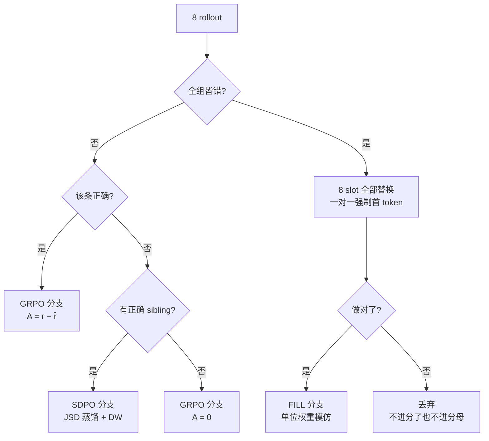

# SRPO v10 设计：FILL 分支

> 目标：解决 SRPO 无法利用的**全错组**，在不破坏论文两分支的前提下把这部分题目学进来。
>
> 基线：论文 SRPO 复现 = **83.0** avg@16 (SciKnowEval Chemistry)

---

## 1. 要解决的问题

论文 §B.5 对全错组的处理是**跳过**：

> When all G rollouts are incorrect, no correct sibling exists, so `m_i = 0` for every rollout... all rollouts are assigned to the GRPO branch

而全错组走 GRPO 时优势为零：

```
8 条 rollout 全错  →  r_i ≡ 0  →  r̄ = 0  →  A_i = r_i − r̄ ≡ 0  →  无梯度
```

所以这些 prompt **对训练毫无贡献**。实测占比 3–16%（早期可达 19/32）。

v10 的目的：把这部分题目变成有效信号。

---

## 2. 核心思路

```
全错组  →  8 个候选首 token 一对一强制生成  →  做对的进 FILL 分支
                                            →  做错的丢弃
```

首 token 是一道**闸门**。模型在这些题上失败，很多时候不是不会，而是开头选错了方向就再也回不来。强制换开头等于用极小的干预探索另一条推理路径。

---

## 3. 路由（三分支互斥、完全覆盖）



| rollout | 条件 | 分支 | 权重 |
|---|---|---|---|
| 正常组·正确 | `c=1` | GRPO | `A = r − r̄` |
| 正常组·错误 + 有 sibling | `c=0, m=1` | SDPO | JSD，无优势 |
| 正常组·错误 + 无 sibling | `c=0, m=0` | GRPO | `A = 0` |
| 全错组·forced·做对 | — | **FILL** | 单位权重 |
| 全错组·forced·做错 | — | **丢弃** | — |

**前两个分支的实现完全未改动**（git 验证：`compute_self_distillation_loss` 与 `compute_policy_loss_vanilla` 在 diff 中出现 0 次）。

---

## 4. Loss

论文 §3.3 的单一分母从两分支扩到三分支：

```
              Σ_GRPO ℓ^GRPO  +  Σ_SDPO ℓ^DW-SDPO  +  Σ_FILL ℓ^FILL
L_final  =  ────────────────────────────────────────────────────────
                    N_GRPO   +   N_SDPO   +   N_FILL
```

FILL 的 per-token loss：

```
ℓ^FILL_{i,t}  =  − clamp(ρ_{i,t}, 1−ε, 1+ε) × s_t          ε = 0.28

              ⎧ w_ft = 9    t = prefix_len（被强制的位置）
s_t  =        ⎨
              ⎩ 1           其余位置

ρ_{i,t} = exp( log π_θ(y_{i,t}) − log π_old(y_{i,t}) )
```

### 实现

```python
lambda_b = N_b / (N_GRPO + N_SDPO + N_FILL)
pg_loss  = λ_grpo·grpo_loss + λ_sdpo·sd_loss + λ_fill·fill_loss
```

`agg_loss` 的 token-mean 是 `masked_sum / mask.sum()`（`batch_num_tokens` 为空时回退），所以
`λ_b × (Σ_b ℓ / N_b) = Σ_b ℓ / N_total`，三项相加恰好是上面那个单一分母的式子。

**不引入新的混合超参** —— 论文 §3.3 明确说 union 归一化的目的就是
*"avoids introducing an additional mixing hyperparameter"*，第三个分支照同一逻辑，权重就是它的 token 占比。

### 自动退火

`λ_fill = N_FILL / N_total`。随着模型学会这些题，死组减少 → `N_FILL → 0` → FILL 分支自然退场。和论文里 SDPO 分支的自衰减性质同构，不需要人工调度。

---

## 5. 为什么不用组内优势

`old_log_prob` 是在 rescue **之后**由 actor 重新前向算出来的（`ray_trainer.py:2252`，`bypass_mode` 未开启）：

```
forced 位置:  old_log_prob = log π_θ(Determin) ≈ log(0.0016) = −6.4
             log_prob     = 同一份权重（每 batch 一次优化器步）≈ −6.4
             ρ ≈ 1        （实测 actor/ppo_kl ≡ 0.0，全程 450 步）
```

梯度满强度，没有衰减。但真正的重要性权重应该是：

```
π_θ(Determin) / π_forced(Determin) = 0.0016 / 1.0 = 0.0016
```

这个权重被那次重算丢掉了。所以更新实质是**在筛选轨迹上做加权最大似然（RFT / STaR）**，不是 policy gradient。

**直接后果**：`A = r − r̄` 在这里没有统计意义。这 8 条是我们人工指定 token 构造出来的，`r̄` 估计的是"forced 分布下的期望回报"，与 `E_{π_θ}[r]` 无关。所以 FILL 用**单位权重**，不用组内优势。

> 顺带一个等价性：`ρ ≈ 1` 时 `d(−clamp(ρ))/d logp = −ρ = −1 = d(−log π)/d logp`。
> 当前配置下 FILL 在数学上就是 CE。写成 ratio 形式只是为了将来若把 `ppo_epochs` 调大或
> mini_batch 调小时 clip 能自动限幅。代价是 `srpo/fill_loss` 读数（≈ −1）不是真实似然。

---

## 6. 为什么首 token 要 ×9

首 token 和续写 token 的处境完全不同：

| | 首 token | 续写 token |
|---|---|---|
| off-policy | **是**，模型 roll 不出来 | 否，给定前缀后完全 on-policy |
| 当前概率 | 0.0016 (`Determin`) | 0.5–0.8 |
| 目标 | ~0.05 才算可达 | 微调即可 |
| 所需 logit 位移 | `ln(0.05/0.0016)` ≈ **3.4** | `ln(0.7/0.6)` ≈ **0.15** |

差约 20 倍。而且它是**闸门**：推理时模型按自己的分布采样第一个 token，`P(Determin)` 不抬起来，后面那条正确路径永远走不到；反过来只开闸不学后续，就是"新开头接旧错误推理"。

均匀 token-mean 会把它稀释 9 倍：

```
v8 独立的 fill_ce:  beta × (1/ft_count)   = 0.01 × (1/7)      = 1.4e-3
v10 均匀:           λ_fill × (1/N_FILL)   = (870/6399)×(1/870) = 1.6e-4
```

`w_ft = 9` 把它补回原强度。可调，`w_ft` 的物理含义 = 闸门推力相对续写 token 的倍数。

| `w_ft` | forced token 梯度 | 相对 v8 |
|---|---|---|
| 1 | 1.6e-4 | 弱 9 倍 |
| 5 | 7.8e-4 | 弱 1.8 倍 |
| **9** | **1.4e-3** | **持平** |
| 20 | 3.1e-3 | 强 2.2 倍 |

---

## 7. 候选池：6 → 8

`datasets/first_token_candidates_chemistry_8.json`

| token_id | token | 基线概率 | 来源 |
|---|---|---|---|
| 1249 | `To` | 0.5054 | v10 补回（v8 的 `skipped_top`） |
| 785 | `The` | 0.4825 | v10 补回 |
| 1654 | `We` | 0.00822 | 原有 |
| 57908 | `Calcul` | 0.00253 | 原有 |
| 92648 | `Determin` | 0.00163 | 原有 |
| 73307 | `Analy` | 0.00055 | 原有 |
| 1986 | `This` | 0.00052 | 原有 |
| 16 | `1` | 0.00039 | 原有 |

全部 token_id 用 Qwen3-8B tokenizer 验证过。

配 `n_baseline_keep=0` + `n_tokens_per_group=8`，则：

```python
free   = idxs[0:]                                          # 全部 8 个 slot
k      = min(8, 8, 8) = 8
chosen = np.random.choice(candidates, size=8, replace=False)  # 8 个全用，随机排列
forced_tokens[j] = chosen[j % 8] = chosen[j]                # 一对一
```

v8 是 `n_baseline_keep=2` + `n_tokens=3` → 6 个 slot 只试 3 个 token（每个 2 次），一半候选没被尝试。

> `n_baseline_keep=0` 只有在**放弃组内优势之后**才成立 —— v8 保留 2 条原始 rollout 是为了给组内优势提供基线。FILL 不用优势，基线就没有意义。相应放宽了校验（原为 `>= 1`）。

---

## 8. 相对 v8 修掉的三个问题

### 8.1 fill_ce 无差别强化错误开头

v8 的 `fill_first_token_mask` 在正确性判断**之外**置位：

```python
if forced_scores[src] >= threshold:
    n_rescued += 1                                  # 正确性只用于计数
if prefix_len < response_length:
    fill_first_token_mask[dst, prefix_len] = 1.0    # 无条件
```

而 `fill_ce_loss = -clamp(ratio)` 里也没有任何优势/reward 项。实测：

| step | forced | 做对 | 被抬高但答错的 |
|---|---|---|---|
| 1 | 30 | 2 | **28 (93%)** |
| 10 | 114 | 28 | **86 (75%)** |
| 25 | 18 | **0** | **18 (100%)** |
| 450 | 6 | **0** | **6 (100%)** |

而 fill_ce 的分母是 `ft_count`（个位数），每 forced token 梯度 `1.4e-3` 比 GRPO 的 `2.2e-4` **强 6 倍**。

后果：验证集 `first_token/pool_frac` 冲到 **55%**，而 rescue 只在 3–16% 的训练组上触发过 —— 信号**过度泛化**，改变了模型在所有 prompt 上的默认开头。同期 `top1_frac` 从 0.515 掉到 0.184。

v10 修复：`if forced_ok and prefix_len < response_length`。

### 8.2 全错组白占分母

v8 只有 `rescued_group_mask`，且**仅在复活时置位**。没复活的死组 8 条全在 `N_GRPO` 分母里，`A ≡ 0` 对分子零贡献 —— 纯稀释：

| step | 死组 | 没复活 | 白占分母 | 占比 |
|---|---|---|---|---|
| 10 | 19 | 5 | 40 条 | **15.6%** |
| 25 | 3 | 3 | 24 条 | **9.4%** |

v10 新增 `fill_group_mask`，覆盖**所有**死组（不论是否复活），从 GRPO 的分子分母**双双剔除**。

复活组里做错的那些也一并剔除 —— 它们在 v8 里拿 `A = 0 − m/8 < 0`，是熵爆炸的燃料（见 `entropy_explosion_analysis.md`）。

### 8.3 select_keys 白名单（实现期发现）

`update_policy` 入口有一份 key 白名单，`data.select(...)` 会丢掉名单外的 key：

```python
select_keys = ["responses", "response_mask", "input_ids", ...]
if srpo_enabled and "rescued_group_mask" in data.batch.keys():
    select_keys.append("rescued_group_mask")
```

新增的 `fill_group_mask` / `fill_correct_mask` 没加进去 → FILL 分支一直看到空 mask，`λ_fill ≡ 0`。

首次运行就是这个症状：`[RESCUE]` 日志显示 "5/48 forced rollouts correct"，但 `srpo/fill_n_correct = 0.0`。

排查中确认无关的环节：TensorDict 按引用存储、`DataProto.union` 保留 key、`prepare_dynamic_batch` 保留 key、`DataProto.batch` 是普通 dataclass 字段。**瓶颈只在最后那道白名单。**

---

## 9. 配置

| 项 | v10 | 说明 |
|---|---|---|
| SRPO 两分支全部参数 | 论文 Table 3 | 不动 |
| `candidate_pool_path` | `..._chemistry_8.json` | 8 token |
| `n_baseline_keep` | **0** | 全部 slot 替换 |
| `n_tokens_per_group` | **8** | 一对一 |
| `fill_ce_clip` | 0.28 | FILL 的 ε |
| `fill_first_token_weight` | **9.0** | `w_ft` |
| `fill_ce_beta` | **0** | 被 FILL 分支取代 |
| `entropy_band_coef` | **0** | 棘轮燃料已移除；留着会污染对比 |
| `ft_ema_kl_coef` | 0 | 关闭（EMA 统计仍记录，供观测） |
| `policy_loss.neg_cov_ratio` | 0 | 关闭 |
| `use_kl_loss` | False | **论文 Table 3 就是 0.0**，不是遗漏 |

运行：

```bash
cd sdpo/SDPO && bash run_local_srpo_v10.sh
FILL_FT_WEIGHT=5 bash run_local_srpo_v10.sh    # 调闸门推力
```

---

## 10. 数值验证

3 组 × 8 rollout 模拟（第 3 组全错，其中 3 条做对）：

```
N_GRPO=1200  N_SDPO=400  N_FILL=300  N_total=1900
lambda: grpo=0.6316  sdpo=0.2105  fill=0.1579   和 = 1.000000

全错组完全离开 GRPO                    ✓
做错的 forced 离开 FILL                ✓
fill_loss = −1.0800，与手算一致        ✓
梯度只落在做对的 3 条上                 ✓
forced 位梯度 / 续写位梯度 = 9.00 = w_ft ✓
每 token 梯度 = 1/N_total = 5.26e-4    ✓
```

---

## 11. 监控

| 指标 | 期望 | 含义 |
|---|---|---|
| `srpo/lambda_fill` | 前期 0.1–0.2，随训练 → 0 | FILL 自动退火 |
| `srpo/fill_n_correct` | 与 `[RESCUE]` 日志的 "N/64 correct" 一致 | 8 个开头救回几条 |
| `srpo/fill_loss` | ≈ −1 到 −1.1 | 偏离说明 clip 起作用了 |
| `first_token/pool_frac` | **关键**：若收敛到 20–30% 而非 v8 的 55% | 说明 §8.1 的方向修正生效 |
| `first_token/top1_frac` | 不应再从 0.51 掉到 0.18 | 同上 |
| `actor/entropy` | ≤ 1.5 | 负优势燃料已移除，不该再爆 |
| `srpo/lambda_sdpo` | 随准确率自然衰减 | 不应被 FILL 顶住不降 |
| `val-core/.../acc/mean@16` | 对标 **83.0** | 纯 SRPO 基线 |

`pool_frac` 是判断 `w_ft=9` 是否合适的主要依据。若仍冲到 50%+，降到 5 或 3 再跑。

---

## 12. 已知风险

**1. FILL 是 RFT/STaR，不是 RL。** 已知失效模式：对发现的解法过拟合、降低多样性。缓解靠 token 占比小且自衰减，但不是零风险。

**2. 多条正确路径的有效多样性被高估。** 8 条 forced 只在第一个 token 不同，后续自由生成，很可能几步后收敛成几乎相同的文本：

```
slot 1: The| solubility of this thiouracil derivative is...
slot 4: Determin|ing the solubility of this thiouracil derivative is...
                  └────────── 之后基本重复 ──────────┘
```

所以 `N_FILL` 会略微高估该 prompt 的真实信息量。未做去重（会引入新判据和超参）。

替代方案：按 prompt 归一化（每个被救回的 prompt 等权，贡献除以 `n_correct`），代价是丢掉"做对越多权重越大"这个偏置 —— 而那个偏置本身是合理的（可复现的发现比碰巧对的更可信）。

**3. `sibling` 选取仍是取索引最小的一条。** `_get_solution` 用 `solution_idxs[0]`。对普通 SRPO 组无妨（i.i.d. 样本，取第一个等价于随机取）；对 fill 产出的路径不成立（首 token 被构造成互不相同）。但实测每个复活组只做对 1–3 条，且需"≥2 条且首 token 不同"才有差别，属低频低收益，**未改**。

**4. 长度崩塌未验证是否解决。** v8-old 与 v8c 的 `response_length` 都从 ~450 缩到 148–212，而论文 Fig 4(a) 说 SRPO 应居中（GRPO 最长、SDPO 最短）。v10 移除了负优势棘轮，但长度崩塌的成因未定位，需观察。

---

## 13. 关键代码位置

| 位置 | 内容 |
|---|---|
| `ray_trainer.py:1148-1161` | 三个 mask 的创建 |
| `ray_trainer.py:1266-1272` | CE 位置的正确性门控 + `fill_correct_mask` 置位 |
| `ray_trainer.py:1276-1279` | `fill_group_mask` 覆盖所有死组 |
| `ray_trainer.py:806-810` | SDPO 排除复活组（**保留**，fill 不涉及 SDPO） |
| `dp_actor.py:755-759` | `select_keys` 白名单（§8.3） |
| `dp_actor.py:916-926` | 全错组从 GRPO mask 剔除 |
| `dp_actor.py:967-1034` | FILL 分支 + 三路 union 归一化 |
| `config/actor.py:163-176` | `fill_first_token_weight`；`n_baseline_keep >= 0` |
| `verl/trainer/config/srpo_v10.yaml` | v10 配置 |
| `run_local_srpo_v10.sh` | 运行脚本 |

## 14. 相关文档

- `entropy_explosion_analysis.md` —— v7/v8 熵爆炸的诊断与文献综述（负优势棘轮的四层不对称、`ΔH ≈ −η·Cov(log π, A)`）
- `srpo_v8_algorithm.md` —— v8 的算法流程
